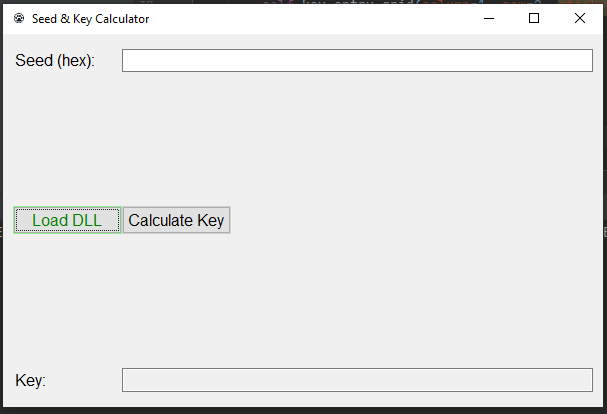

The Seed & Key Calculator is a simple python program to calculate the key required to access protected resources in ECU. Program use DLL (Win32 ASAP1a) files to calcluate key. DLL files are not included. 
